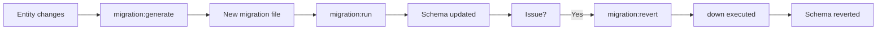
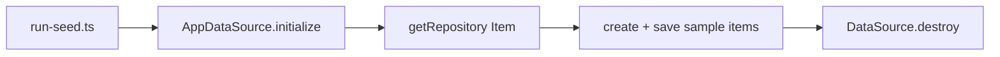
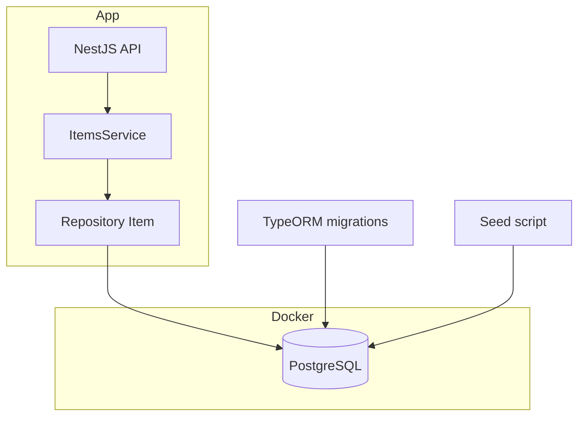

# A Test Repo for Seeding & Migrations in TypeORM

A test repository for **seeding** and **migrations** in TypeORM, with a NestJS API and PostgreSQL in Docker.

## Features

- **TypeORM migrations**: Two migrations are included:
  - `CreateItemTable`: creates the `item` table (id, name, description, isActive, created_at, updated_at).
  - `AddQuantityToItem`: adds the `quantity` column to `item`.
- **Migration commands**: Run, revert, and generate migrations via npm scripts using the TypeORM CLI.
- **Seeding**: A seed script uses the TypeORM `Repository<Item>` to insert sample items into PostgreSQL.
- **NestJS API**: Minimal REST API with `GET /items` and `GET /items/:id` to read items.
- **PostgreSQL in Docker**: Docker Compose runs PostgreSQL 15 Alpine.

## Dependencies

### Production

| Package | Purpose |
| ------- | ------- |
| `@nestjs/common`, `@nestjs/core`, `@nestjs/platform-express` | NestJS framework |
| `@nestjs/typeorm` | NestJS TypeORM integration |
| `dotenv` | Load `.env` for configuration |
| `pg` | PostgreSQL driver for TypeORM |
| `reflect-metadata` | Decorator metadata for TypeORM |
| `rxjs` | NestJS dependency |
| `typeorm` | ORM and migrations |

### Development

| Package | Purpose |
| ------- | ------- |
| `@nestjs/cli` | NestJS CLI (build, start) |
| `@types/node` | Node.js type definitions |
| `tsconfig-paths` | Path mapping for `ts-node` (seed script) |
| `ts-node` | Run TypeScript seed script |
| `typeorm-ts-node-commonjs` | Run TypeScript migrations with TypeORM CLI |
| `typescript` | TypeScript compiler |

## Prerequisites

- Node.js (v20 or later recommended)
- Docker and Docker Compose (for PostgreSQL)
- npm or yarn

## Quick start

1. **Clone and install**

   ```bash
   cd /path/to/test-repo-for-seeding-and-migrations-in-TypeORM
   npm install
   ```

2. **Configure environment**

   ```bash
   cp .env.example .env
   # Edit .env if your PostgreSQL host/port/user/password/database differ.
   ```

3. **Start PostgreSQL**

   ```bash
   docker-compose up -d postgres
   ```

4. **Run migrations**

   ```bash
   npm run migration:run
   ```

5. **Seed the database**

   ```bash
   npm run seed
   ```

6. **Start the API**

   ```bash
   npm run start
   ```

   Then open: `http://localhost:3000/items`

## Code change summary

- **Root**: `package.json` (scripts for typeorm, migration:run, migration:revert, migration:generate, seed), `tsconfig.json` (inlineSourceMap, inlineSources, sourceMap false, removeComments false), `docker-compose.yml`, `Dockerfile.postgres`, `.env.example`, `nest-cli.json`.
- **src/data-source.ts**: DataSource for TypeORM CLI and seed script. It loads `.env`, connects to PostgreSQL, and points to `entity` and `migrations` under `src`.
- **src/entity/item.entity.ts**: `Item` entity (id, name, description, isActive, quantity, createdAt, updatedAt) with Doxygen comments.
- **src/migrations/**:
  - `1739180400000-CreateItemTable.ts`: `up` creates `item` table, and `down` drops it.
  - `1739180500000-AddQuantityToItem.ts`: `up` adds `quantity` column, and `down` drops it.
- **src/seeds/run-seed.ts**: Uses `AppDataSource.getRepository(Item)` to create and save sample items.
- **src/app.module.ts**, **src/main.ts**: NestJS bootstrap and TypeORM registration.
- **src/items/**: `ItemsModule`, `ItemsService`, `ItemsController` for GET /items and GET /items/:id.

## How migrations work (TypeORM)

- **migration:generate**: Compares your **entity** definitions to the **current database schema** and generates a new migration file with the required SQL. Use after changing entities. Example:

  ```bash
  npx typeorm-ts-node-commonjs migration:generate ./src/migrations/AddNewColumn -d ./src/data-source.ts
  ```

  If no schema diff is found, the command exits with code 1.

- **migration:run**: Runs all **pending** migrations in timestamp order (each migration’s `up()` is executed). Applied migrations are recorded in the `migrations` table.

- **migration:revert**: Reverts the **last** executed migration by running its `down()` method. Run multiple times to revert multiple migrations in reverse order.

## Rollback (revert) database changes

To undo the most recently applied migration:

```bash
npm run migration:revert
```

This runs the `down()` method of the latest migration (e.g. it drops the `quantity` column if that was the last one run). To revert again, run the same command (next `down()` will drop the `item` table if that was the previous migration). TypeORM does not support reverting an arbitrary migration by name. Revert is always “last in, first out”.

## Flowcharts

### Migration run and revert



### Seed flow



### Application and database



## Testing and debugging

### Run the API and call endpoints

```bash
npm run start
# In another terminal:
curl http://localhost:3000/items
curl http://localhost:3000/items/<uuid-from-above>
```

### Run migrations and seed

```bash
npm run migration:run
npm run seed
```

### Revert last migration

```bash
npm run migration:revert
```

### Generate a new migration (after changing an entity)

Ensure the database is running and the schema matches the previous migration state, then:

```bash
npm run typeorm -- migration:generate ./src/migrations/YourMigrationName -d ./src/data-source.ts
```

### Debugging

- **Database connection**: Check `.env` and that the PostgreSQL container is running (`docker compose ps`). Logs: `docker compose logs postgres`.
- **Migrations**: TypeORM logs which migrations run. If a migration fails, fix the migration file or data and run again. You may need to fix the `migrations` table or revert first.
- **Seed**: The seed script logs “Seeding complete: N item(s) inserted.” or an error. Ensure migrations have been run so the `item` table exists.
- **API**: Use `npm run start:dev` for watch mode. Check that the port in use (default 3000) is free.
